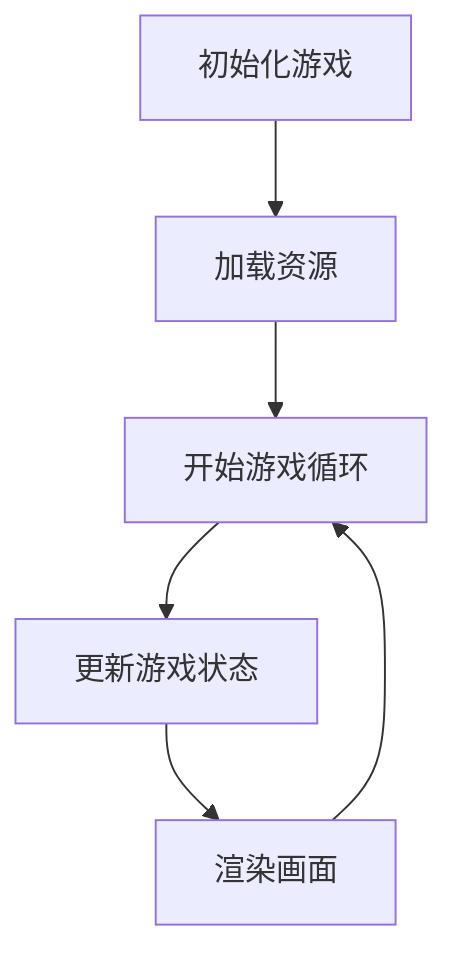

# 快乐小鸡游戏 - 架构设计文档

<version>1.1.0</version>

## 状态：Draft

## 简介
本文档描述了快乐小鸡游戏的基本架构设计，专注于本地网页游戏的实现。

## 技术选型

### 前端技术
- HTML5：游戏页面结构
- CSS3：样式和动画
- JavaScript：游戏逻辑
- Canvas API：游戏画面渲染
- Web Audio API：音效处理

## 系统架构

### 核心模块
1. 游戏主循环（Game Loop）
   - 负责更新游戏状态
   - 处理用户输入
   - 更新画面

2. 渲染系统
   - Canvas 2D上下文
   - 处理精灵动画
   - 更新游戏画面

3. 输入系统
   - 鼠标点击事件处理
   - 触摸事件处理（可选）

4. 音频系统
   - 加载和播放音效
   - 音效开关控制

## 文件组织

```
game/
├── index.html          # 游戏主页面
├── style.css          # 样式文件
├── game.js            # 游戏主逻辑
└── assets/            # 游戏资源
    ├── images/        # 图片资源
    └── sounds/        # 音效资源
```

## 主要类设计

### Game 类
```javascript
class Game {
    constructor() {
        this.canvas = null;
        this.context = null;
        this.chicken = null;
        this.score = 0;
    }
    
    init() { /* 初始化游戏 */ }
    update() { /* 更新游戏状态 */ }
    render() { /* 渲染画面 */ }
}
```

### Chicken 类
```javascript
class Chicken {
    constructor() {
        this.x = 0;
        this.y = 0;
        this.sprite = null;
    }
    
    move() { /* 随机移动 */ }
    layEgg() { /* 下蛋动作 */ }
}
```

## 游戏状态流程



## 变更日志

| 版本   | 变更               | 描述                   |
|-------|-------------------|------------------------|
| 1.0.0 | 初始版本          | 初始架构设计            |
| 1.1.0 | 简化版本          | 简化为本地网页游戏架构   | 