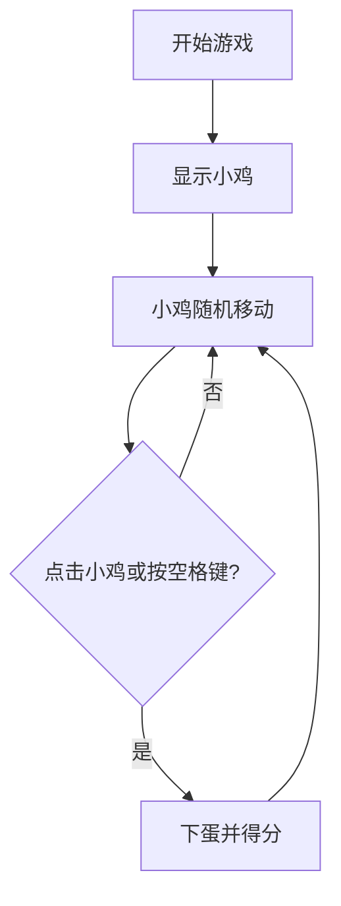

# 1. Title: PRD for 快乐小鸡游戏 (Happy Chicken Game)

<version>1.1.0</version>

## Status: Draft

## 简介

本PRD描述了一款名为"快乐小鸡"的简单网页小游戏，灵感来源于小猪佩奇动画中的快乐小鸡角色。这款游戏主要面向2岁左右的幼儿，通过简单的点击互动和可爱的视觉效果，提供愉快的游戏体验。

## 目标

- 创建一款适合2岁儿童操作的简单网页游戏
- 提供可爱、明亮的视觉效果
- 通过简单的点击交互促进幼儿手眼协调能力
- 通过下蛋计分的方式，为幼儿提供成就感

## 功能需求

### 核心功能
- 一只卡通风格小鸡在屏幕上随机蹦跳移动
- 点击小鸡时，小鸡会下一个蛋并播放音效
- 按空格键时，效果等同于点击小鸡，会下蛋并播放音效
- 每下一个蛋增加一分，分数显示在屏幕上
- 简单的开始界面
- 背景为简单的农场风景

### 游戏限制
- 不包含任何复杂的游戏机制
- 不包含任何文字指令（除了分数显示）
- 适合2岁幼儿操作的简单界面

## 技术实现

### 技术栈
- HTML5：游戏页面结构
- CSS3：基础样式
- JavaScript：游戏逻辑
- Canvas：绘制游戏画面
- Web Audio API：简单音效

### 文件结构
```
game/
├── index.html      # 游戏主页面
├── style.css       # 样式文件
├── game.js         # 游戏主逻辑
└── assets/         # 游戏资源
    ├── images/     # 图片资源
    └── sounds/     # 音效资源
```

## 游戏流程



## 变更日志

| 版本    | 变更                 | 描述                     |
|--------|---------------------|--------------------------|
| 1.0.0  | 初始版本            | 初始PRD草稿              |
| 1.1.0  | 简化版本            | 简化为纯本地网页游戏版本   |
| 1.2.0  | 添加空格键控制     | 用户现在可以通过按空格键进行游戏 | 